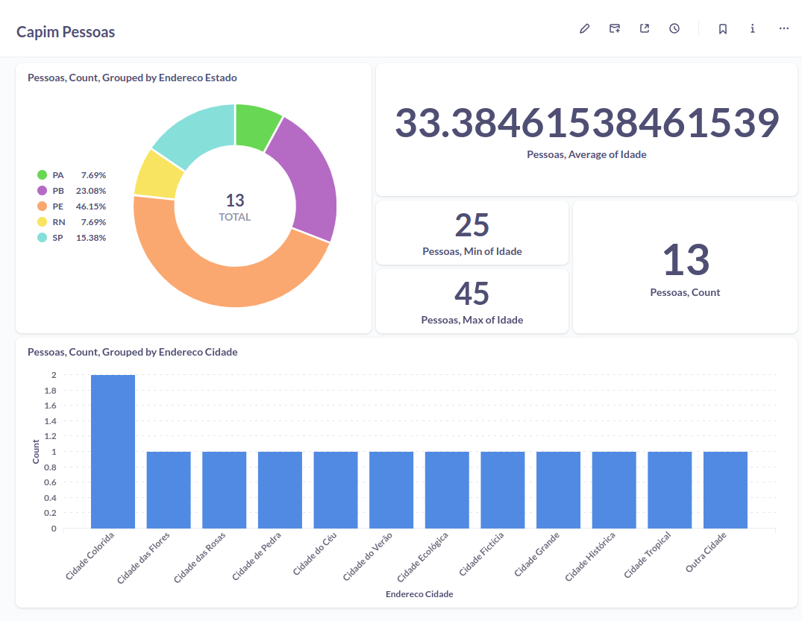

# Projeto para ETL de dados em aquivos JSON em banco de dados Postgres e visualização no Metabase

### Overview

O propósito do projeto é fazer uma inserção dos dados de arquivos JSON em um banco de dados Postgres. Para isso, se faz necessária uma deduplicação dos dados para não haver registros repetidos no banco de dados destino.

### Instalações necessárias

* Docker
* Python 3

### Passo a passo de execução

#### Passo 1: Preenchimento do .env.example com os valores das variáveis de ambiente

Nesse momento, é necessário alterar os valores de configuração do banco Postgres. 

```sh
export POSTGRES_USER="postgres"
export POSTGRES_PASSWORD="password"
export POSTGRES_HOST="localhost"
export POSTGRES_DB="postgres"
export POSTGRES_PORT=5432
```

Depois de atualizado, execute o arquivo da seguinte forma:

```sh
source .env.example
```

#### Passo 2: Criação do ambiente Python e instalação das bibliotecas necessárias

```sh
# Criação da env
python3 -m venv venv

# Ativação da env
source venv/bin/activate

# Instalações das bibliotecas
pip install -r requirements.txt
```

#### Passo 3: Setup do banco Postgres com Docker

```sh
# Pull da imagem postgres do Docker Hub
docker pull postgres

# Criação do network
docker network create my-network

# Criação do volume para persistência dos dados no Postgres
docker volume create pgdata

# Criação do container com o Postgres
docker run -d --name postgres --network my-network -p 5432:5432 -e POSTGRES_PASSWORD=$POSTGRES_PASSWORD -v pgdata:/var/lib/postgresql/data postgres

# Pull da imagem do Metabase do Docker Hub
docker pull metabase/metabase:latest

# Criação do volume para persistência dos dados no Metabase
docker volume create metabase-data

# Criação do container com o Metabase na mesma network que o Postgres
docker run -d -p 3000:3000 --name metabase --network my-network -v metabase-data:/metabase-data -e "MB_DB_FILE=/metabase-data/metabase.db" metabase/metabase
```

É importante observar que utilizamos o mesmo network para ambos os containers. Isso é necessário para a comunicação e o compartilhamento dos dados entre ambos.

Nesse momento, faz-se necessário a configuração do Metabase para conexão com o banco postgres. Para o host, basta colocar o nome que demos ao container, ou seja, `postgres`.

#### Passo 4: ETL dos dados

Basta executar o arquivo `data_load.py` que os dados do arquivo JSON na pasta `data` serão enviados ao banco Postgres.

```python
python3 data_load.py
```

### Visualização dos dados no Metabase

Com os dados ingeridos no banco e com conexão entre o Metabase e o Postgres realizada, é possível vermos os dados de forma mais analítica. Abaixo temos um exemplo de um dashboard feito no Metabase:



### Logs

Os registros serão salvos na pasta logs, com um status de sucesso ou falha. Abaixo está um exemplo do arquivo de logs.

```txt
[2024-04-21 19:55:26.546884] Quantidade de registros duplicados e removidos do JSON: 1
[2024-04-21 19:55:26.547298] Erro ao tentar enviar dados para o banco Postgres: invalid literal for int() with base 10: 'None'
[2024-04-21 19:56:10.974103] Quantidade de registros duplicados e removidos do JSON: 1
[2024-04-21 19:57:30.646142] Dados enviados para o banco Postgres com sucesso!
```
